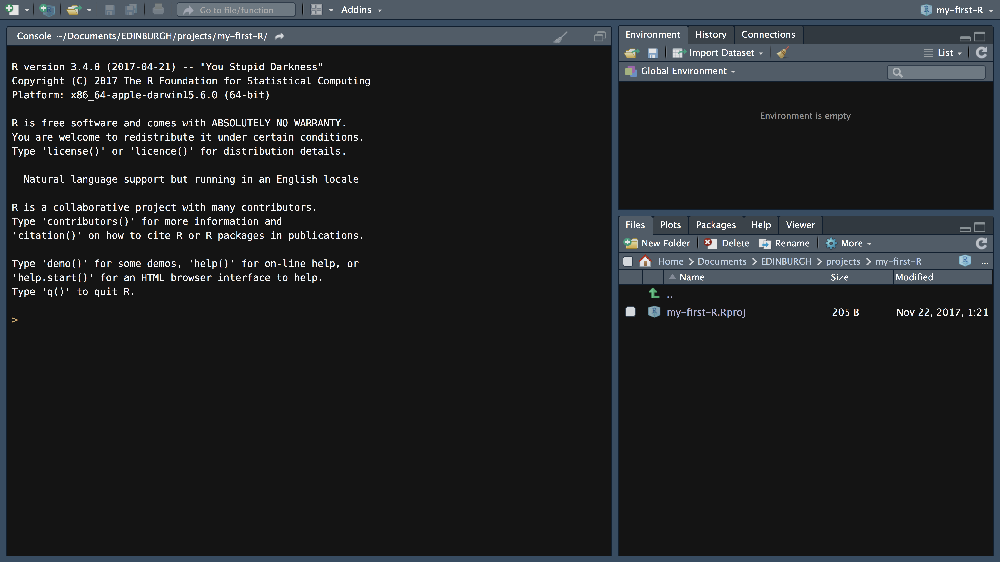
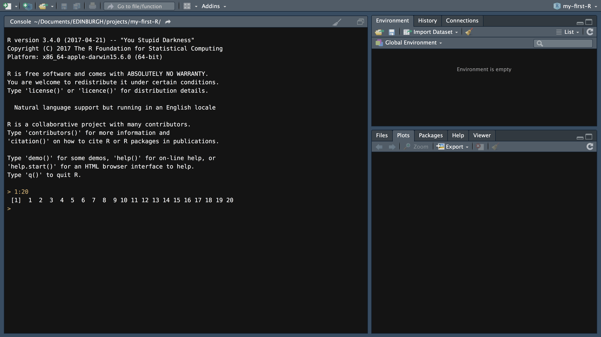
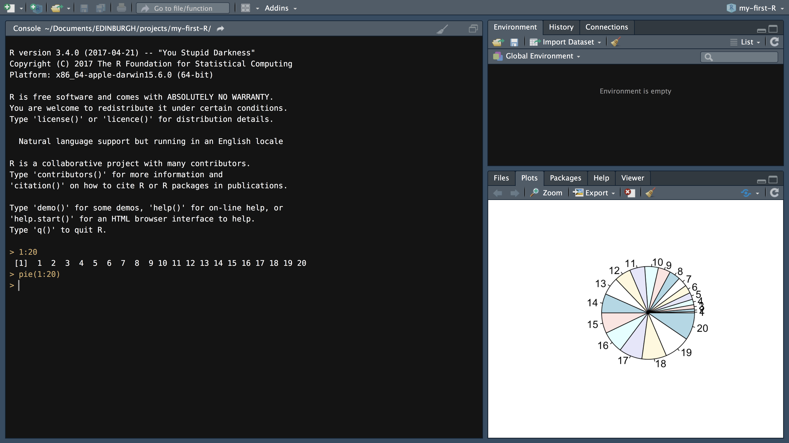
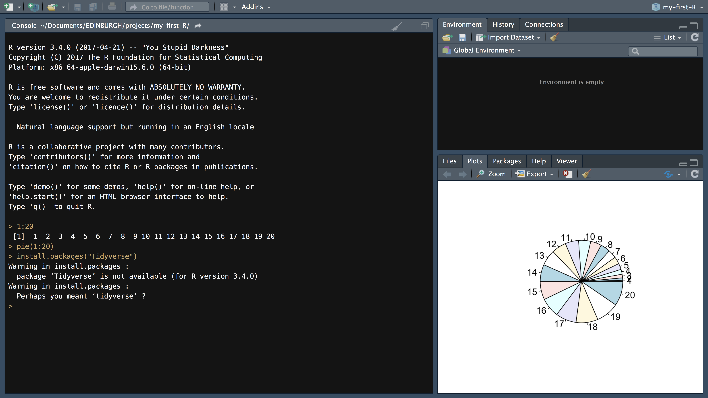
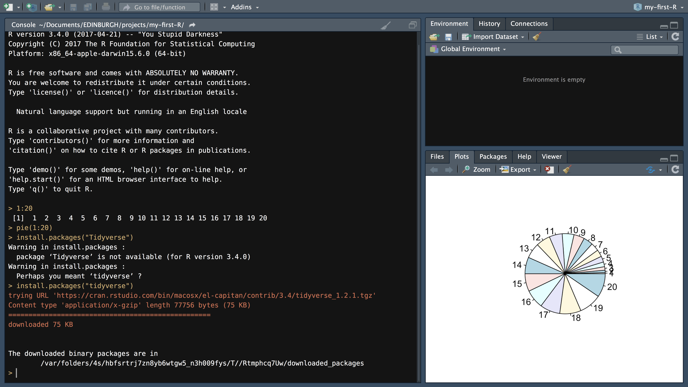

```{r opts, include = FALSE}
options(width = 90)
library(knitr)
library(tidyverse)
opts_chunk$set(comment="", 
               digits = 3, 
               tidy = FALSE, 
               prompt = FALSE,
               fig.align = 'center',
               out.width = "600px")
theme_set(theme_classic() + theme(legend.position = "top"))
```

## Welcome to RStudio

```{r, out.width="100%", echo = FALSE}

```
---

```{r, out.width="100%", echo = FALSE}

```
---

```{r, out.width="100%", echo = FALSE}

```
---

```{r, out.width="100%", echo = FALSE}

```
---

```{r, out.width="100%", echo = FALSE}

```
---

