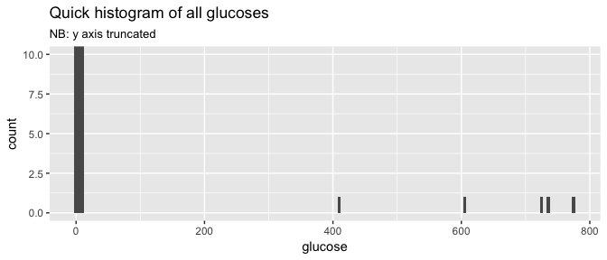

# Data Wrangling Example


```r
library(tidyverse)
library(stringr) # for text string stuff
library(forcats) # for factor stuff
library(knitr) # for markdown options
library(kableExtra) # makes tables nicer
```


Importing and tidy some ficitious data

NB: These results are very much made up!


## Import data

From sheet number 1 of the spreadsheet

(Can use the sheet "name" instead of sheet number)


```r
DATA_FILE_NAME <- "ih-trial_results_20171020.xlsx"

dat <- readxl::read_excel(DATA_FILE_NAME, sheet = 1)
```
  


| subject|sex              |age      |treatment | rep| week 1| week 2| week 3| week 4|
|-------:|:----------------|:--------|:---------|---:|------:|------:|------:|------:|
|       1|fn               |6 months |A         |   1|   0.34|   3.49|   2.15|   4.85|
|       1|                 |         |          |   2|   3.97|   6.78|   4.27|   4.52|
|       1|                 |         |          |   3|   4.05|   5.97|   5.56|   7.53|
|       2|mn               |12       |B         |   1|   6.56|   7.01|   7.07|   6.30|
|       2|                 |         |          |   2|   6.97|   6.03|   6.24|   6.95|
|       2|                 |         |          |   3|   9.77|   5.85|   7.71|  10.80|
|       3|female nneutered |11       |A         |   1|   3.04|   7.09|   3.23|   4.13|
|       3|                 |         |          |   2|   1.14|   5.04|   7.23| 408.00|
|       3|                 |         |          |   3|   7.19|   5.31|   2.08|   8.59|
|       4|mn               |9        |B         |   1|   7.86|   7.44|   9.03| 737.00|
|       4|                 |         |          |   2|   5.78|   9.00|   8.77|   9.91|
|       4|                 |         |          |   3|   8.10|   9.88|  12.43|   9.95|
|       5|mn               |7        |A         |   1|   1.72|   8.68|   4.21|   0.93|
|       5|                 |         |          |   2|   5.49|   8.39|   3.87|   3.68|
|       5|                 |         |          |   3|   4.20|   7.51|   7.36|   6.58|
|       6|male entire      |5        |B         |   1|   4.89|   7.46|   9.69|   8.14|
|       6|                 |         |          |   2| 604.00|   8.91|   6.31|   9.63|
|       6|                 |         |          |   3|   8.28|   9.63|   8.24|   8.01|
|       7|mn               |3        |A         |   1|   7.94|   2.79|   1.85|   5.84|
|       7|                 |         |          |   2|   2.71|   1.99|   7.85|   3.77|
|       7|                 |         |          |   3|   7.29|   4.91|   7.48|   6.12|
|       8|fn               |7        |B         |   1|   9.07|   4.72|  10.28|   6.62|
|       8|                 |         |          |   2|   6.53|   8.49|   9.64|   8.59|
|       8|                 |         |          |   3|   4.27|  10.17|  10.43|   7.82|
|       9|male entire      |3        |A         |   1|   5.95|   6.25|   6.13|   8.07|
|       9|                 |         |          |   2|   5.31|   0.40|   5.29|   4.78|
|       9|                 |         |          |   3|   4.58|   6.61|   6.39|   7.04|
|      10|mn               |10       |B         |   1|  11.34|   5.72|   9.87|   9.25|
|      10|                 |         |          |   2|   7.01|  10.82|  11.03|  10.00|
|      10|                 |         |          |   3|  10.97|   7.25|   9.17|   7.44|
|      11|fn               |6        |A         |   1|   4.07|   1.84|   3.41|   4.67|
|      11|                 |         |          |   2|   3.72|   0.48|   4.88|   6.39|
|      11|                 |         |          |   3|   2.30|   7.09|   3.37|   6.24|
|      12|MN               |5        |B         |   1|   5.19|   6.52| 723.00|  10.86|
|      12|                 |         |          |   2|   5.77| 776.00|   4.26|   9.17|
|      12|                 |         |          |   3|   8.27|   9.38|   6.47|  10.51|


## Fill down the 'gappy' columns


```r
dat <- dat %>% 
  fill(sex, age, treatment)
```

| subject|sex              |age      |treatment | rep| week 1| week 2| week 3| week 4|
|-------:|:----------------|:--------|:---------|---:|------:|------:|------:|------:|
|       1|fn               |6 months |A         |   1|   0.34|   3.49|   2.15|   4.85|
|       1|fn               |6 months |A         |   2|   3.97|   6.78|   4.27|   4.52|
|       1|fn               |6 months |A         |   3|   4.05|   5.97|   5.56|   7.53|
|       2|mn               |12       |B         |   1|   6.56|   7.01|   7.07|   6.30|
|       2|mn               |12       |B         |   2|   6.97|   6.03|   6.24|   6.95|
|       2|mn               |12       |B         |   3|   9.77|   5.85|   7.71|  10.80|
|       3|female nneutered |11       |A         |   1|   3.04|   7.09|   3.23|   4.13|
|       3|female nneutered |11       |A         |   2|   1.14|   5.04|   7.23| 408.00|
|       3|female nneutered |11       |A         |   3|   7.19|   5.31|   2.08|   8.59|
|       4|mn               |9        |B         |   1|   7.86|   7.44|   9.03| 737.00|
|       4|mn               |9        |B         |   2|   5.78|   9.00|   8.77|   9.91|
|       4|mn               |9        |B         |   3|   8.10|   9.88|  12.43|   9.95|
|       5|mn               |7        |A         |   1|   1.72|   8.68|   4.21|   0.93|
|       5|mn               |7        |A         |   2|   5.49|   8.39|   3.87|   3.68|
|       5|mn               |7        |A         |   3|   4.20|   7.51|   7.36|   6.58|
|       6|male entire      |5        |B         |   1|   4.89|   7.46|   9.69|   8.14|
|       6|male entire      |5        |B         |   2| 604.00|   8.91|   6.31|   9.63|
|       6|male entire      |5        |B         |   3|   8.28|   9.63|   8.24|   8.01|
|       7|mn               |3        |A         |   1|   7.94|   2.79|   1.85|   5.84|
|       7|mn               |3        |A         |   2|   2.71|   1.99|   7.85|   3.77|
|       7|mn               |3        |A         |   3|   7.29|   4.91|   7.48|   6.12|
|       8|fn               |7        |B         |   1|   9.07|   4.72|  10.28|   6.62|
|       8|fn               |7        |B         |   2|   6.53|   8.49|   9.64|   8.59|
|       8|fn               |7        |B         |   3|   4.27|  10.17|  10.43|   7.82|
|       9|male entire      |3        |A         |   1|   5.95|   6.25|   6.13|   8.07|
|       9|male entire      |3        |A         |   2|   5.31|   0.40|   5.29|   4.78|
|       9|male entire      |3        |A         |   3|   4.58|   6.61|   6.39|   7.04|
|      10|mn               |10       |B         |   1|  11.34|   5.72|   9.87|   9.25|
|      10|mn               |10       |B         |   2|   7.01|  10.82|  11.03|  10.00|
|      10|mn               |10       |B         |   3|  10.97|   7.25|   9.17|   7.44|
|      11|fn               |6        |A         |   1|   4.07|   1.84|   3.41|   4.67|
|      11|fn               |6        |A         |   2|   3.72|   0.48|   4.88|   6.39|
|      11|fn               |6        |A         |   3|   2.30|   7.09|   3.37|   6.24|
|      12|MN               |5        |B         |   1|   5.19|   6.52| 723.00|  10.86|
|      12|MN               |5        |B         |   2|   5.77| 776.00|   4.26|   9.17|
|      12|MN               |5        |B         |   3|   8.27|   9.38|   6.47|  10.51|


## Make the subject ID nice


```r
dat <- dat %>% 
  mutate(subject = paste0("A", str_pad(subject, 3, "left", "0")))
```


|subject |sex              |age      |treatment | rep| week 1| week 2| week 3| week 4|
|:-------|:----------------|:--------|:---------|---:|------:|------:|------:|------:|
|A001    |fn               |6 months |A         |   1|   0.34|   3.49|   2.15|   4.85|
|A001    |fn               |6 months |A         |   2|   3.97|   6.78|   4.27|   4.52|
|A001    |fn               |6 months |A         |   3|   4.05|   5.97|   5.56|   7.53|
|A002    |mn               |12       |B         |   1|   6.56|   7.01|   7.07|   6.30|
|A002    |mn               |12       |B         |   2|   6.97|   6.03|   6.24|   6.95|
|A002    |mn               |12       |B         |   3|   9.77|   5.85|   7.71|  10.80|
|A003    |female nneutered |11       |A         |   1|   3.04|   7.09|   3.23|   4.13|
|A003    |female nneutered |11       |A         |   2|   1.14|   5.04|   7.23| 408.00|
|A003    |female nneutered |11       |A         |   3|   7.19|   5.31|   2.08|   8.59|
|A004    |mn               |9        |B         |   1|   7.86|   7.44|   9.03| 737.00|
|A004    |mn               |9        |B         |   2|   5.78|   9.00|   8.77|   9.91|
|A004    |mn               |9        |B         |   3|   8.10|   9.88|  12.43|   9.95|
|A005    |mn               |7        |A         |   1|   1.72|   8.68|   4.21|   0.93|
|A005    |mn               |7        |A         |   2|   5.49|   8.39|   3.87|   3.68|
|A005    |mn               |7        |A         |   3|   4.20|   7.51|   7.36|   6.58|
|A006    |male entire      |5        |B         |   1|   4.89|   7.46|   9.69|   8.14|
|A006    |male entire      |5        |B         |   2| 604.00|   8.91|   6.31|   9.63|
|A006    |male entire      |5        |B         |   3|   8.28|   9.63|   8.24|   8.01|
|A007    |mn               |3        |A         |   1|   7.94|   2.79|   1.85|   5.84|
|A007    |mn               |3        |A         |   2|   2.71|   1.99|   7.85|   3.77|
|A007    |mn               |3        |A         |   3|   7.29|   4.91|   7.48|   6.12|
|A008    |fn               |7        |B         |   1|   9.07|   4.72|  10.28|   6.62|
|A008    |fn               |7        |B         |   2|   6.53|   8.49|   9.64|   8.59|
|A008    |fn               |7        |B         |   3|   4.27|  10.17|  10.43|   7.82|
|A009    |male entire      |3        |A         |   1|   5.95|   6.25|   6.13|   8.07|
|A009    |male entire      |3        |A         |   2|   5.31|   0.40|   5.29|   4.78|
|A009    |male entire      |3        |A         |   3|   4.58|   6.61|   6.39|   7.04|
|A010    |mn               |10       |B         |   1|  11.34|   5.72|   9.87|   9.25|
|A010    |mn               |10       |B         |   2|   7.01|  10.82|  11.03|  10.00|
|A010    |mn               |10       |B         |   3|  10.97|   7.25|   9.17|   7.44|
|A011    |fn               |6        |A         |   1|   4.07|   1.84|   3.41|   4.67|
|A011    |fn               |6        |A         |   2|   3.72|   0.48|   4.88|   6.39|
|A011    |fn               |6        |A         |   3|   2.30|   7.09|   3.37|   6.24|
|A012    |MN               |5        |B         |   1|   5.19|   6.52| 723.00|  10.86|
|A012    |MN               |5        |B         |   2|   5.77| 776.00|   4.26|   9.17|
|A012    |MN               |5        |B         |   3|   8.27|   9.38|   6.47|  10.51|


## Clean the sex/status column

### Tally sex spellings

This doesn't change the dataframe - just prints a sumary table


```r
dat %>%
  group_by(sex) %>%
  tally() %>% 
  kable(format = "html", caption = "Recorded sexes") %>% 
  kable_styling(full_width = FALSE) # looks better
```

<table class="table" style="width: auto !important; margin-left: auto; margin-right: auto;">
<caption>Recorded sexes</caption>
 <thead><tr>
<th style="text-align:left;"> sex </th>
   <th style="text-align:right;"> n </th>
  </tr></thead>
<tbody>
<tr>
<td style="text-align:left;"> female nneutered </td>
   <td style="text-align:right;"> 3 </td>
  </tr>
<tr>
<td style="text-align:left;"> fn </td>
   <td style="text-align:right;"> 9 </td>
  </tr>
<tr>
<td style="text-align:left;"> male entire </td>
   <td style="text-align:right;"> 6 </td>
  </tr>
<tr>
<td style="text-align:left;"> mn </td>
   <td style="text-align:right;"> 15 </td>
  </tr>
<tr>
<td style="text-align:left;"> MN </td>
   <td style="text-align:right;"> 3 </td>
  </tr>
</tbody>
</table>

### Fix sex spellings


```r
dat <- dat %>%
  mutate(sex = case_when(sex == "female nneutered" ~ "fn",
                         sex == "male entire" ~ "me",
                         sex == "MN" ~ "mn",
                         TRUE ~ sex))
```


|subject |sex |age      |treatment | rep| week 1| week 2| week 3| week 4|
|:-------|:---|:--------|:---------|---:|------:|------:|------:|------:|
|A001    |fn  |6 months |A         |   1|   0.34|   3.49|   2.15|   4.85|
|A001    |fn  |6 months |A         |   2|   3.97|   6.78|   4.27|   4.52|
|A001    |fn  |6 months |A         |   3|   4.05|   5.97|   5.56|   7.53|
|A002    |mn  |12       |B         |   1|   6.56|   7.01|   7.07|   6.30|
|A002    |mn  |12       |B         |   2|   6.97|   6.03|   6.24|   6.95|
|A002    |mn  |12       |B         |   3|   9.77|   5.85|   7.71|  10.80|
|A003    |fn  |11       |A         |   1|   3.04|   7.09|   3.23|   4.13|
|A003    |fn  |11       |A         |   2|   1.14|   5.04|   7.23| 408.00|
|A003    |fn  |11       |A         |   3|   7.19|   5.31|   2.08|   8.59|
|A004    |mn  |9        |B         |   1|   7.86|   7.44|   9.03| 737.00|
|A004    |mn  |9        |B         |   2|   5.78|   9.00|   8.77|   9.91|
|A004    |mn  |9        |B         |   3|   8.10|   9.88|  12.43|   9.95|
|A005    |mn  |7        |A         |   1|   1.72|   8.68|   4.21|   0.93|
|A005    |mn  |7        |A         |   2|   5.49|   8.39|   3.87|   3.68|
|A005    |mn  |7        |A         |   3|   4.20|   7.51|   7.36|   6.58|
|A006    |me  |5        |B         |   1|   4.89|   7.46|   9.69|   8.14|
|A006    |me  |5        |B         |   2| 604.00|   8.91|   6.31|   9.63|
|A006    |me  |5        |B         |   3|   8.28|   9.63|   8.24|   8.01|
|A007    |mn  |3        |A         |   1|   7.94|   2.79|   1.85|   5.84|
|A007    |mn  |3        |A         |   2|   2.71|   1.99|   7.85|   3.77|
|A007    |mn  |3        |A         |   3|   7.29|   4.91|   7.48|   6.12|
|A008    |fn  |7        |B         |   1|   9.07|   4.72|  10.28|   6.62|
|A008    |fn  |7        |B         |   2|   6.53|   8.49|   9.64|   8.59|
|A008    |fn  |7        |B         |   3|   4.27|  10.17|  10.43|   7.82|
|A009    |me  |3        |A         |   1|   5.95|   6.25|   6.13|   8.07|
|A009    |me  |3        |A         |   2|   5.31|   0.40|   5.29|   4.78|
|A009    |me  |3        |A         |   3|   4.58|   6.61|   6.39|   7.04|
|A010    |mn  |10       |B         |   1|  11.34|   5.72|   9.87|   9.25|
|A010    |mn  |10       |B         |   2|   7.01|  10.82|  11.03|  10.00|
|A010    |mn  |10       |B         |   3|  10.97|   7.25|   9.17|   7.44|
|A011    |fn  |6        |A         |   1|   4.07|   1.84|   3.41|   4.67|
|A011    |fn  |6        |A         |   2|   3.72|   0.48|   4.88|   6.39|
|A011    |fn  |6        |A         |   3|   2.30|   7.09|   3.37|   6.24|
|A012    |mn  |5        |B         |   1|   5.19|   6.52| 723.00|  10.86|
|A012    |mn  |5        |B         |   2|   5.77| 776.00|   4.26|   9.17|
|A012    |mn  |5        |B         |   3|   8.27|   9.38|   6.47|  10.51|


## Separate sex/status into 2 columns


```r
dat <- dat %>% 
  tidyr::separate(sex, c("sex", "neuter_status"), 1)
```


|subject |sex |neuter_status |age      |treatment | rep| week 1| week 2| week 3| week 4|
|:-------|:---|:-------------|:--------|:---------|---:|------:|------:|------:|------:|
|A001    |f   |n             |6 months |A         |   1|   0.34|   3.49|   2.15|   4.85|
|A001    |f   |n             |6 months |A         |   2|   3.97|   6.78|   4.27|   4.52|
|A001    |f   |n             |6 months |A         |   3|   4.05|   5.97|   5.56|   7.53|
|A002    |m   |n             |12       |B         |   1|   6.56|   7.01|   7.07|   6.30|
|A002    |m   |n             |12       |B         |   2|   6.97|   6.03|   6.24|   6.95|
|A002    |m   |n             |12       |B         |   3|   9.77|   5.85|   7.71|  10.80|
|A003    |f   |n             |11       |A         |   1|   3.04|   7.09|   3.23|   4.13|
|A003    |f   |n             |11       |A         |   2|   1.14|   5.04|   7.23| 408.00|
|A003    |f   |n             |11       |A         |   3|   7.19|   5.31|   2.08|   8.59|
|A004    |m   |n             |9        |B         |   1|   7.86|   7.44|   9.03| 737.00|
|A004    |m   |n             |9        |B         |   2|   5.78|   9.00|   8.77|   9.91|
|A004    |m   |n             |9        |B         |   3|   8.10|   9.88|  12.43|   9.95|
|A005    |m   |n             |7        |A         |   1|   1.72|   8.68|   4.21|   0.93|
|A005    |m   |n             |7        |A         |   2|   5.49|   8.39|   3.87|   3.68|
|A005    |m   |n             |7        |A         |   3|   4.20|   7.51|   7.36|   6.58|
|A006    |m   |e             |5        |B         |   1|   4.89|   7.46|   9.69|   8.14|
|A006    |m   |e             |5        |B         |   2| 604.00|   8.91|   6.31|   9.63|
|A006    |m   |e             |5        |B         |   3|   8.28|   9.63|   8.24|   8.01|
|A007    |m   |n             |3        |A         |   1|   7.94|   2.79|   1.85|   5.84|
|A007    |m   |n             |3        |A         |   2|   2.71|   1.99|   7.85|   3.77|
|A007    |m   |n             |3        |A         |   3|   7.29|   4.91|   7.48|   6.12|
|A008    |f   |n             |7        |B         |   1|   9.07|   4.72|  10.28|   6.62|
|A008    |f   |n             |7        |B         |   2|   6.53|   8.49|   9.64|   8.59|
|A008    |f   |n             |7        |B         |   3|   4.27|  10.17|  10.43|   7.82|
|A009    |m   |e             |3        |A         |   1|   5.95|   6.25|   6.13|   8.07|
|A009    |m   |e             |3        |A         |   2|   5.31|   0.40|   5.29|   4.78|
|A009    |m   |e             |3        |A         |   3|   4.58|   6.61|   6.39|   7.04|
|A010    |m   |n             |10       |B         |   1|  11.34|   5.72|   9.87|   9.25|
|A010    |m   |n             |10       |B         |   2|   7.01|  10.82|  11.03|  10.00|
|A010    |m   |n             |10       |B         |   3|  10.97|   7.25|   9.17|   7.44|
|A011    |f   |n             |6        |A         |   1|   4.07|   1.84|   3.41|   4.67|
|A011    |f   |n             |6        |A         |   2|   3.72|   0.48|   4.88|   6.39|
|A011    |f   |n             |6        |A         |   3|   2.30|   7.09|   3.37|   6.24|
|A012    |m   |n             |5        |B         |   1|   5.19|   6.52| 723.00|  10.86|
|A012    |m   |n             |5        |B         |   2|   5.77| 776.00|   4.26|   9.17|
|A012    |m   |n             |5        |B         |   3|   8.27|   9.38|   6.47|  10.51|


## Make ages in months into years


```r
dat <- dat %>%
  mutate(age = case_when(
                    str_detect(age, "month") ~ parse_number(age) / 12,
                    TRUE ~ parse_number(age)))
```


|subject |sex |neuter_status |  age|treatment | rep| week 1| week 2| week 3| week 4|
|:-------|:---|:-------------|----:|:---------|---:|------:|------:|------:|------:|
|A001    |f   |n             |  0.5|A         |   1|   0.34|   3.49|   2.15|   4.85|
|A001    |f   |n             |  0.5|A         |   2|   3.97|   6.78|   4.27|   4.52|
|A001    |f   |n             |  0.5|A         |   3|   4.05|   5.97|   5.56|   7.53|
|A002    |m   |n             | 12.0|B         |   1|   6.56|   7.01|   7.07|   6.30|
|A002    |m   |n             | 12.0|B         |   2|   6.97|   6.03|   6.24|   6.95|
|A002    |m   |n             | 12.0|B         |   3|   9.77|   5.85|   7.71|  10.80|
|A003    |f   |n             | 11.0|A         |   1|   3.04|   7.09|   3.23|   4.13|
|A003    |f   |n             | 11.0|A         |   2|   1.14|   5.04|   7.23| 408.00|
|A003    |f   |n             | 11.0|A         |   3|   7.19|   5.31|   2.08|   8.59|
|A004    |m   |n             |  9.0|B         |   1|   7.86|   7.44|   9.03| 737.00|
|A004    |m   |n             |  9.0|B         |   2|   5.78|   9.00|   8.77|   9.91|
|A004    |m   |n             |  9.0|B         |   3|   8.10|   9.88|  12.43|   9.95|
|A005    |m   |n             |  7.0|A         |   1|   1.72|   8.68|   4.21|   0.93|
|A005    |m   |n             |  7.0|A         |   2|   5.49|   8.39|   3.87|   3.68|
|A005    |m   |n             |  7.0|A         |   3|   4.20|   7.51|   7.36|   6.58|
|A006    |m   |e             |  5.0|B         |   1|   4.89|   7.46|   9.69|   8.14|
|A006    |m   |e             |  5.0|B         |   2| 604.00|   8.91|   6.31|   9.63|
|A006    |m   |e             |  5.0|B         |   3|   8.28|   9.63|   8.24|   8.01|
|A007    |m   |n             |  3.0|A         |   1|   7.94|   2.79|   1.85|   5.84|
|A007    |m   |n             |  3.0|A         |   2|   2.71|   1.99|   7.85|   3.77|
|A007    |m   |n             |  3.0|A         |   3|   7.29|   4.91|   7.48|   6.12|
|A008    |f   |n             |  7.0|B         |   1|   9.07|   4.72|  10.28|   6.62|
|A008    |f   |n             |  7.0|B         |   2|   6.53|   8.49|   9.64|   8.59|
|A008    |f   |n             |  7.0|B         |   3|   4.27|  10.17|  10.43|   7.82|
|A009    |m   |e             |  3.0|A         |   1|   5.95|   6.25|   6.13|   8.07|
|A009    |m   |e             |  3.0|A         |   2|   5.31|   0.40|   5.29|   4.78|
|A009    |m   |e             |  3.0|A         |   3|   4.58|   6.61|   6.39|   7.04|
|A010    |m   |n             | 10.0|B         |   1|  11.34|   5.72|   9.87|   9.25|
|A010    |m   |n             | 10.0|B         |   2|   7.01|  10.82|  11.03|  10.00|
|A010    |m   |n             | 10.0|B         |   3|  10.97|   7.25|   9.17|   7.44|
|A011    |f   |n             |  6.0|A         |   1|   4.07|   1.84|   3.41|   4.67|
|A011    |f   |n             |  6.0|A         |   2|   3.72|   0.48|   4.88|   6.39|
|A011    |f   |n             |  6.0|A         |   3|   2.30|   7.09|   3.37|   6.24|
|A012    |m   |n             |  5.0|B         |   1|   5.19|   6.52| 723.00|  10.86|
|A012    |m   |n             |  5.0|B         |   2|   5.77| 776.00|   4.26|   9.17|
|A012    |m   |n             |  5.0|B         |   3|   8.27|   9.38|   6.47|  10.51|


## Gather results and add week column


```r
dat <- dat %>%
  tidyr::gather("week", "glucose", `week 1`:`week 4`) %>% 
  mutate(week = parse_number(week))
```


|subject |sex |neuter_status |  age|treatment | rep| week| glucose|
|:-------|:---|:-------------|----:|:---------|---:|----:|-------:|
|A001    |f   |n             |  0.5|A         |   1|    1|    0.34|
|A001    |f   |n             |  0.5|A         |   2|    1|    3.97|
|A001    |f   |n             |  0.5|A         |   3|    1|    4.05|
|A002    |m   |n             | 12.0|B         |   1|    1|    6.56|
|A002    |m   |n             | 12.0|B         |   2|    1|    6.97|
|A002    |m   |n             | 12.0|B         |   3|    1|    9.77|
|A003    |f   |n             | 11.0|A         |   1|    1|    3.04|
|A003    |f   |n             | 11.0|A         |   2|    1|    1.14|
|A003    |f   |n             | 11.0|A         |   3|    1|    7.19|
|A004    |m   |n             |  9.0|B         |   1|    1|    7.86|
|A004    |m   |n             |  9.0|B         |   2|    1|    5.78|
|A004    |m   |n             |  9.0|B         |   3|    1|    8.10|
|A005    |m   |n             |  7.0|A         |   1|    1|    1.72|
|A005    |m   |n             |  7.0|A         |   2|    1|    5.49|
|A005    |m   |n             |  7.0|A         |   3|    1|    4.20|
|A006    |m   |e             |  5.0|B         |   1|    1|    4.89|
|A006    |m   |e             |  5.0|B         |   2|    1|  604.00|
|A006    |m   |e             |  5.0|B         |   3|    1|    8.28|
|A007    |m   |n             |  3.0|A         |   1|    1|    7.94|
|A007    |m   |n             |  3.0|A         |   2|    1|    2.71|
|A007    |m   |n             |  3.0|A         |   3|    1|    7.29|
|A008    |f   |n             |  7.0|B         |   1|    1|    9.07|
|A008    |f   |n             |  7.0|B         |   2|    1|    6.53|
|A008    |f   |n             |  7.0|B         |   3|    1|    4.27|
|A009    |m   |e             |  3.0|A         |   1|    1|    5.95|
|A009    |m   |e             |  3.0|A         |   2|    1|    5.31|
|A009    |m   |e             |  3.0|A         |   3|    1|    4.58|
|A010    |m   |n             | 10.0|B         |   1|    1|   11.34|
|A010    |m   |n             | 10.0|B         |   2|    1|    7.01|
|A010    |m   |n             | 10.0|B         |   3|    1|   10.97|
|A011    |f   |n             |  6.0|A         |   1|    1|    4.07|
|A011    |f   |n             |  6.0|A         |   2|    1|    3.72|
|A011    |f   |n             |  6.0|A         |   3|    1|    2.30|
|A012    |m   |n             |  5.0|B         |   1|    1|    5.19|
|A012    |m   |n             |  5.0|B         |   2|    1|    5.77|
|A012    |m   |n             |  5.0|B         |   3|    1|    8.27|
|A001    |f   |n             |  0.5|A         |   1|    2|    3.49|
|A001    |f   |n             |  0.5|A         |   2|    2|    6.78|
|A001    |f   |n             |  0.5|A         |   3|    2|    5.97|
|A002    |m   |n             | 12.0|B         |   1|    2|    7.01|
|A002    |m   |n             | 12.0|B         |   2|    2|    6.03|
|A002    |m   |n             | 12.0|B         |   3|    2|    5.85|
|A003    |f   |n             | 11.0|A         |   1|    2|    7.09|
|A003    |f   |n             | 11.0|A         |   2|    2|    5.04|
|A003    |f   |n             | 11.0|A         |   3|    2|    5.31|
|A004    |m   |n             |  9.0|B         |   1|    2|    7.44|
|A004    |m   |n             |  9.0|B         |   2|    2|    9.00|
|A004    |m   |n             |  9.0|B         |   3|    2|    9.88|
|A005    |m   |n             |  7.0|A         |   1|    2|    8.68|
|A005    |m   |n             |  7.0|A         |   2|    2|    8.39|
|A005    |m   |n             |  7.0|A         |   3|    2|    7.51|
|A006    |m   |e             |  5.0|B         |   1|    2|    7.46|
|A006    |m   |e             |  5.0|B         |   2|    2|    8.91|
|A006    |m   |e             |  5.0|B         |   3|    2|    9.63|
|A007    |m   |n             |  3.0|A         |   1|    2|    2.79|
|A007    |m   |n             |  3.0|A         |   2|    2|    1.99|
|A007    |m   |n             |  3.0|A         |   3|    2|    4.91|
|A008    |f   |n             |  7.0|B         |   1|    2|    4.72|
|A008    |f   |n             |  7.0|B         |   2|    2|    8.49|
|A008    |f   |n             |  7.0|B         |   3|    2|   10.17|
|A009    |m   |e             |  3.0|A         |   1|    2|    6.25|
|A009    |m   |e             |  3.0|A         |   2|    2|    0.40|
|A009    |m   |e             |  3.0|A         |   3|    2|    6.61|
|A010    |m   |n             | 10.0|B         |   1|    2|    5.72|
|A010    |m   |n             | 10.0|B         |   2|    2|   10.82|
|A010    |m   |n             | 10.0|B         |   3|    2|    7.25|
|A011    |f   |n             |  6.0|A         |   1|    2|    1.84|
|A011    |f   |n             |  6.0|A         |   2|    2|    0.48|
|A011    |f   |n             |  6.0|A         |   3|    2|    7.09|
|A012    |m   |n             |  5.0|B         |   1|    2|    6.52|
|A012    |m   |n             |  5.0|B         |   2|    2|  776.00|
|A012    |m   |n             |  5.0|B         |   3|    2|    9.38|
|A001    |f   |n             |  0.5|A         |   1|    3|    2.15|
|A001    |f   |n             |  0.5|A         |   2|    3|    4.27|
|A001    |f   |n             |  0.5|A         |   3|    3|    5.56|
|A002    |m   |n             | 12.0|B         |   1|    3|    7.07|
|A002    |m   |n             | 12.0|B         |   2|    3|    6.24|
|A002    |m   |n             | 12.0|B         |   3|    3|    7.71|
|A003    |f   |n             | 11.0|A         |   1|    3|    3.23|
|A003    |f   |n             | 11.0|A         |   2|    3|    7.23|
|A003    |f   |n             | 11.0|A         |   3|    3|    2.08|
|A004    |m   |n             |  9.0|B         |   1|    3|    9.03|
|A004    |m   |n             |  9.0|B         |   2|    3|    8.77|
|A004    |m   |n             |  9.0|B         |   3|    3|   12.43|
|A005    |m   |n             |  7.0|A         |   1|    3|    4.21|
|A005    |m   |n             |  7.0|A         |   2|    3|    3.87|
|A005    |m   |n             |  7.0|A         |   3|    3|    7.36|
|A006    |m   |e             |  5.0|B         |   1|    3|    9.69|
|A006    |m   |e             |  5.0|B         |   2|    3|    6.31|
|A006    |m   |e             |  5.0|B         |   3|    3|    8.24|
|A007    |m   |n             |  3.0|A         |   1|    3|    1.85|
|A007    |m   |n             |  3.0|A         |   2|    3|    7.85|
|A007    |m   |n             |  3.0|A         |   3|    3|    7.48|
|A008    |f   |n             |  7.0|B         |   1|    3|   10.28|
|A008    |f   |n             |  7.0|B         |   2|    3|    9.64|
|A008    |f   |n             |  7.0|B         |   3|    3|   10.43|
|A009    |m   |e             |  3.0|A         |   1|    3|    6.13|
|A009    |m   |e             |  3.0|A         |   2|    3|    5.29|
|A009    |m   |e             |  3.0|A         |   3|    3|    6.39|
|A010    |m   |n             | 10.0|B         |   1|    3|    9.87|
|A010    |m   |n             | 10.0|B         |   2|    3|   11.03|
|A010    |m   |n             | 10.0|B         |   3|    3|    9.17|
|A011    |f   |n             |  6.0|A         |   1|    3|    3.41|
|A011    |f   |n             |  6.0|A         |   2|    3|    4.88|
|A011    |f   |n             |  6.0|A         |   3|    3|    3.37|
|A012    |m   |n             |  5.0|B         |   1|    3|  723.00|
|A012    |m   |n             |  5.0|B         |   2|    3|    4.26|
|A012    |m   |n             |  5.0|B         |   3|    3|    6.47|
|A001    |f   |n             |  0.5|A         |   1|    4|    4.85|
|A001    |f   |n             |  0.5|A         |   2|    4|    4.52|
|A001    |f   |n             |  0.5|A         |   3|    4|    7.53|
|A002    |m   |n             | 12.0|B         |   1|    4|    6.30|
|A002    |m   |n             | 12.0|B         |   2|    4|    6.95|
|A002    |m   |n             | 12.0|B         |   3|    4|   10.80|
|A003    |f   |n             | 11.0|A         |   1|    4|    4.13|
|A003    |f   |n             | 11.0|A         |   2|    4|  408.00|
|A003    |f   |n             | 11.0|A         |   3|    4|    8.59|
|A004    |m   |n             |  9.0|B         |   1|    4|  737.00|
|A004    |m   |n             |  9.0|B         |   2|    4|    9.91|
|A004    |m   |n             |  9.0|B         |   3|    4|    9.95|
|A005    |m   |n             |  7.0|A         |   1|    4|    0.93|
|A005    |m   |n             |  7.0|A         |   2|    4|    3.68|
|A005    |m   |n             |  7.0|A         |   3|    4|    6.58|
|A006    |m   |e             |  5.0|B         |   1|    4|    8.14|
|A006    |m   |e             |  5.0|B         |   2|    4|    9.63|
|A006    |m   |e             |  5.0|B         |   3|    4|    8.01|
|A007    |m   |n             |  3.0|A         |   1|    4|    5.84|
|A007    |m   |n             |  3.0|A         |   2|    4|    3.77|
|A007    |m   |n             |  3.0|A         |   3|    4|    6.12|
|A008    |f   |n             |  7.0|B         |   1|    4|    6.62|
|A008    |f   |n             |  7.0|B         |   2|    4|    8.59|
|A008    |f   |n             |  7.0|B         |   3|    4|    7.82|
|A009    |m   |e             |  3.0|A         |   1|    4|    8.07|
|A009    |m   |e             |  3.0|A         |   2|    4|    4.78|
|A009    |m   |e             |  3.0|A         |   3|    4|    7.04|
|A010    |m   |n             | 10.0|B         |   1|    4|    9.25|
|A010    |m   |n             | 10.0|B         |   2|    4|   10.00|
|A010    |m   |n             | 10.0|B         |   3|    4|    7.44|
|A011    |f   |n             |  6.0|A         |   1|    4|    4.67|
|A011    |f   |n             |  6.0|A         |   2|    4|    6.39|
|A011    |f   |n             |  6.0|A         |   3|    4|    6.24|
|A012    |m   |n             |  5.0|B         |   1|    4|   10.86|
|A012    |m   |n             |  5.0|B         |   2|    4|    9.17|
|A012    |m   |n             |  5.0|B         |   3|    4|   10.51|


## Check glucose for obvious typos


```r
ggplot(dat, aes(x = glucose)) +
  geom_histogram(binwidth = 5) +
  coord_cartesian(ylim = c(0, 10)) + 
  labs(title = "Quick histogram of all glucoses",
       subtitle = "NB: y axis truncated")
```

<!-- -->

### Make a table of unusual results

This doesn't change the dataframe - just makes a table


```r
dat %>% 
  dplyr::filter(glucose > 50) %>% 
  dplyr::select(subject, week, rep, glucose) %>% 
  kable(format = "html", caption = "Unusually high glucose results") %>% 
  kable_styling(full_width = FALSE) # looks better
```

<table class="table" style="width: auto !important; margin-left: auto; margin-right: auto;">
<caption>Unusually high glucose results</caption>
 <thead><tr>
<th style="text-align:left;"> subject </th>
   <th style="text-align:right;"> week </th>
   <th style="text-align:right;"> rep </th>
   <th style="text-align:right;"> glucose </th>
  </tr></thead>
<tbody>
<tr>
<td style="text-align:left;"> A006 </td>
   <td style="text-align:right;"> 1 </td>
   <td style="text-align:right;"> 2 </td>
   <td style="text-align:right;"> 604 </td>
  </tr>
<tr>
<td style="text-align:left;"> A012 </td>
   <td style="text-align:right;"> 2 </td>
   <td style="text-align:right;"> 2 </td>
   <td style="text-align:right;"> 776 </td>
  </tr>
<tr>
<td style="text-align:left;"> A012 </td>
   <td style="text-align:right;"> 3 </td>
   <td style="text-align:right;"> 1 </td>
   <td style="text-align:right;"> 723 </td>
  </tr>
<tr>
<td style="text-align:left;"> A003 </td>
   <td style="text-align:right;"> 4 </td>
   <td style="text-align:right;"> 2 </td>
   <td style="text-align:right;"> 408 </td>
  </tr>
<tr>
<td style="text-align:left;"> A004 </td>
   <td style="text-align:right;"> 4 </td>
   <td style="text-align:right;"> 1 </td>
   <td style="text-align:right;"> 737 </td>
  </tr>
</tbody>
</table>

### Now fix unusually high results

(Lets assume we went back to the paper records)


```r
dat <- dat %>%
  mutate(glucose = case_when(subject == "A006" &
                             week == 1 &
                             rep == 2 ~         6.04,
                           
                           subject == "A012" &
                             week == 2 &
                             rep == 2 ~         7.76,
                           
                           subject == "A012" &
                             week == 3 &
                             rep == 1 ~         7.23,
                           
                           subject == "A003" &
                             week == 4 &
                             rep == 2 ~         4.08,
                           
                           subject == "A004" &
                             week == 4 &
                             rep == 1 ~         7.37,
                           
                           TRUE ~               glucose))
```


|subject |sex |neuter_status |  age|treatment | rep| week| glucose|
|:-------|:---|:-------------|----:|:---------|---:|----:|-------:|
|A001    |f   |n             |  0.5|A         |   1|    1|    0.34|
|A001    |f   |n             |  0.5|A         |   2|    1|    3.97|
|A001    |f   |n             |  0.5|A         |   3|    1|    4.05|
|A002    |m   |n             | 12.0|B         |   1|    1|    6.56|
|A002    |m   |n             | 12.0|B         |   2|    1|    6.97|
|A002    |m   |n             | 12.0|B         |   3|    1|    9.77|
|A003    |f   |n             | 11.0|A         |   1|    1|    3.04|
|A003    |f   |n             | 11.0|A         |   2|    1|    1.14|
|A003    |f   |n             | 11.0|A         |   3|    1|    7.19|
|A004    |m   |n             |  9.0|B         |   1|    1|    7.86|
|A004    |m   |n             |  9.0|B         |   2|    1|    5.78|
|A004    |m   |n             |  9.0|B         |   3|    1|    8.10|
|A005    |m   |n             |  7.0|A         |   1|    1|    1.72|
|A005    |m   |n             |  7.0|A         |   2|    1|    5.49|
|A005    |m   |n             |  7.0|A         |   3|    1|    4.20|
|A006    |m   |e             |  5.0|B         |   1|    1|    4.89|
|A006    |m   |e             |  5.0|B         |   2|    1|    6.04|
|A006    |m   |e             |  5.0|B         |   3|    1|    8.28|
|A007    |m   |n             |  3.0|A         |   1|    1|    7.94|
|A007    |m   |n             |  3.0|A         |   2|    1|    2.71|
|A007    |m   |n             |  3.0|A         |   3|    1|    7.29|
|A008    |f   |n             |  7.0|B         |   1|    1|    9.07|
|A008    |f   |n             |  7.0|B         |   2|    1|    6.53|
|A008    |f   |n             |  7.0|B         |   3|    1|    4.27|
|A009    |m   |e             |  3.0|A         |   1|    1|    5.95|
|A009    |m   |e             |  3.0|A         |   2|    1|    5.31|
|A009    |m   |e             |  3.0|A         |   3|    1|    4.58|
|A010    |m   |n             | 10.0|B         |   1|    1|   11.34|
|A010    |m   |n             | 10.0|B         |   2|    1|    7.01|
|A010    |m   |n             | 10.0|B         |   3|    1|   10.97|
|A011    |f   |n             |  6.0|A         |   1|    1|    4.07|
|A011    |f   |n             |  6.0|A         |   2|    1|    3.72|
|A011    |f   |n             |  6.0|A         |   3|    1|    2.30|
|A012    |m   |n             |  5.0|B         |   1|    1|    5.19|
|A012    |m   |n             |  5.0|B         |   2|    1|    5.77|
|A012    |m   |n             |  5.0|B         |   3|    1|    8.27|
|A001    |f   |n             |  0.5|A         |   1|    2|    3.49|
|A001    |f   |n             |  0.5|A         |   2|    2|    6.78|
|A001    |f   |n             |  0.5|A         |   3|    2|    5.97|
|A002    |m   |n             | 12.0|B         |   1|    2|    7.01|
|A002    |m   |n             | 12.0|B         |   2|    2|    6.03|
|A002    |m   |n             | 12.0|B         |   3|    2|    5.85|
|A003    |f   |n             | 11.0|A         |   1|    2|    7.09|
|A003    |f   |n             | 11.0|A         |   2|    2|    5.04|
|A003    |f   |n             | 11.0|A         |   3|    2|    5.31|
|A004    |m   |n             |  9.0|B         |   1|    2|    7.44|
|A004    |m   |n             |  9.0|B         |   2|    2|    9.00|
|A004    |m   |n             |  9.0|B         |   3|    2|    9.88|
|A005    |m   |n             |  7.0|A         |   1|    2|    8.68|
|A005    |m   |n             |  7.0|A         |   2|    2|    8.39|
|A005    |m   |n             |  7.0|A         |   3|    2|    7.51|
|A006    |m   |e             |  5.0|B         |   1|    2|    7.46|
|A006    |m   |e             |  5.0|B         |   2|    2|    8.91|
|A006    |m   |e             |  5.0|B         |   3|    2|    9.63|
|A007    |m   |n             |  3.0|A         |   1|    2|    2.79|
|A007    |m   |n             |  3.0|A         |   2|    2|    1.99|
|A007    |m   |n             |  3.0|A         |   3|    2|    4.91|
|A008    |f   |n             |  7.0|B         |   1|    2|    4.72|
|A008    |f   |n             |  7.0|B         |   2|    2|    8.49|
|A008    |f   |n             |  7.0|B         |   3|    2|   10.17|
|A009    |m   |e             |  3.0|A         |   1|    2|    6.25|
|A009    |m   |e             |  3.0|A         |   2|    2|    0.40|
|A009    |m   |e             |  3.0|A         |   3|    2|    6.61|
|A010    |m   |n             | 10.0|B         |   1|    2|    5.72|
|A010    |m   |n             | 10.0|B         |   2|    2|   10.82|
|A010    |m   |n             | 10.0|B         |   3|    2|    7.25|
|A011    |f   |n             |  6.0|A         |   1|    2|    1.84|
|A011    |f   |n             |  6.0|A         |   2|    2|    0.48|
|A011    |f   |n             |  6.0|A         |   3|    2|    7.09|
|A012    |m   |n             |  5.0|B         |   1|    2|    6.52|
|A012    |m   |n             |  5.0|B         |   2|    2|    7.76|
|A012    |m   |n             |  5.0|B         |   3|    2|    9.38|
|A001    |f   |n             |  0.5|A         |   1|    3|    2.15|
|A001    |f   |n             |  0.5|A         |   2|    3|    4.27|
|A001    |f   |n             |  0.5|A         |   3|    3|    5.56|
|A002    |m   |n             | 12.0|B         |   1|    3|    7.07|
|A002    |m   |n             | 12.0|B         |   2|    3|    6.24|
|A002    |m   |n             | 12.0|B         |   3|    3|    7.71|
|A003    |f   |n             | 11.0|A         |   1|    3|    3.23|
|A003    |f   |n             | 11.0|A         |   2|    3|    7.23|
|A003    |f   |n             | 11.0|A         |   3|    3|    2.08|
|A004    |m   |n             |  9.0|B         |   1|    3|    9.03|
|A004    |m   |n             |  9.0|B         |   2|    3|    8.77|
|A004    |m   |n             |  9.0|B         |   3|    3|   12.43|
|A005    |m   |n             |  7.0|A         |   1|    3|    4.21|
|A005    |m   |n             |  7.0|A         |   2|    3|    3.87|
|A005    |m   |n             |  7.0|A         |   3|    3|    7.36|
|A006    |m   |e             |  5.0|B         |   1|    3|    9.69|
|A006    |m   |e             |  5.0|B         |   2|    3|    6.31|
|A006    |m   |e             |  5.0|B         |   3|    3|    8.24|
|A007    |m   |n             |  3.0|A         |   1|    3|    1.85|
|A007    |m   |n             |  3.0|A         |   2|    3|    7.85|
|A007    |m   |n             |  3.0|A         |   3|    3|    7.48|
|A008    |f   |n             |  7.0|B         |   1|    3|   10.28|
|A008    |f   |n             |  7.0|B         |   2|    3|    9.64|
|A008    |f   |n             |  7.0|B         |   3|    3|   10.43|
|A009    |m   |e             |  3.0|A         |   1|    3|    6.13|
|A009    |m   |e             |  3.0|A         |   2|    3|    5.29|
|A009    |m   |e             |  3.0|A         |   3|    3|    6.39|
|A010    |m   |n             | 10.0|B         |   1|    3|    9.87|
|A010    |m   |n             | 10.0|B         |   2|    3|   11.03|
|A010    |m   |n             | 10.0|B         |   3|    3|    9.17|
|A011    |f   |n             |  6.0|A         |   1|    3|    3.41|
|A011    |f   |n             |  6.0|A         |   2|    3|    4.88|
|A011    |f   |n             |  6.0|A         |   3|    3|    3.37|
|A012    |m   |n             |  5.0|B         |   1|    3|    7.23|
|A012    |m   |n             |  5.0|B         |   2|    3|    4.26|
|A012    |m   |n             |  5.0|B         |   3|    3|    6.47|
|A001    |f   |n             |  0.5|A         |   1|    4|    4.85|
|A001    |f   |n             |  0.5|A         |   2|    4|    4.52|
|A001    |f   |n             |  0.5|A         |   3|    4|    7.53|
|A002    |m   |n             | 12.0|B         |   1|    4|    6.30|
|A002    |m   |n             | 12.0|B         |   2|    4|    6.95|
|A002    |m   |n             | 12.0|B         |   3|    4|   10.80|
|A003    |f   |n             | 11.0|A         |   1|    4|    4.13|
|A003    |f   |n             | 11.0|A         |   2|    4|    4.08|
|A003    |f   |n             | 11.0|A         |   3|    4|    8.59|
|A004    |m   |n             |  9.0|B         |   1|    4|    7.37|
|A004    |m   |n             |  9.0|B         |   2|    4|    9.91|
|A004    |m   |n             |  9.0|B         |   3|    4|    9.95|
|A005    |m   |n             |  7.0|A         |   1|    4|    0.93|
|A005    |m   |n             |  7.0|A         |   2|    4|    3.68|
|A005    |m   |n             |  7.0|A         |   3|    4|    6.58|
|A006    |m   |e             |  5.0|B         |   1|    4|    8.14|
|A006    |m   |e             |  5.0|B         |   2|    4|    9.63|
|A006    |m   |e             |  5.0|B         |   3|    4|    8.01|
|A007    |m   |n             |  3.0|A         |   1|    4|    5.84|
|A007    |m   |n             |  3.0|A         |   2|    4|    3.77|
|A007    |m   |n             |  3.0|A         |   3|    4|    6.12|
|A008    |f   |n             |  7.0|B         |   1|    4|    6.62|
|A008    |f   |n             |  7.0|B         |   2|    4|    8.59|
|A008    |f   |n             |  7.0|B         |   3|    4|    7.82|
|A009    |m   |e             |  3.0|A         |   1|    4|    8.07|
|A009    |m   |e             |  3.0|A         |   2|    4|    4.78|
|A009    |m   |e             |  3.0|A         |   3|    4|    7.04|
|A010    |m   |n             | 10.0|B         |   1|    4|    9.25|
|A010    |m   |n             | 10.0|B         |   2|    4|   10.00|
|A010    |m   |n             | 10.0|B         |   3|    4|    7.44|
|A011    |f   |n             |  6.0|A         |   1|    4|    4.67|
|A011    |f   |n             |  6.0|A         |   2|    4|    6.39|
|A011    |f   |n             |  6.0|A         |   3|    4|    6.24|
|A012    |m   |n             |  5.0|B         |   1|    4|   10.86|
|A012    |m   |n             |  5.0|B         |   2|    4|    9.17|
|A012    |m   |n             |  5.0|B         |   3|    4|   10.51|

## Create a new column for when glucose > 5


```r
dat <- dat %>%
  mutate(glucose_category = case_when(glucose > 5.0 ~ "high",
                                  glucose <= 5.0 ~ "normal",
                                  NA ~ NA_character_,
                                  TRUE ~ "other"))
```


|subject |sex |neuter_status |  age|treatment | rep| week| glucose|glucose_category |
|:-------|:---|:-------------|----:|:---------|---:|----:|-------:|:----------------|
|A001    |f   |n             |  0.5|A         |   1|    1|    0.34|normal           |
|A001    |f   |n             |  0.5|A         |   2|    1|    3.97|normal           |
|A001    |f   |n             |  0.5|A         |   3|    1|    4.05|normal           |
|A002    |m   |n             | 12.0|B         |   1|    1|    6.56|high             |
|A002    |m   |n             | 12.0|B         |   2|    1|    6.97|high             |
|A002    |m   |n             | 12.0|B         |   3|    1|    9.77|high             |
|A003    |f   |n             | 11.0|A         |   1|    1|    3.04|normal           |
|A003    |f   |n             | 11.0|A         |   2|    1|    1.14|normal           |
|A003    |f   |n             | 11.0|A         |   3|    1|    7.19|high             |
|A004    |m   |n             |  9.0|B         |   1|    1|    7.86|high             |
|A004    |m   |n             |  9.0|B         |   2|    1|    5.78|high             |
|A004    |m   |n             |  9.0|B         |   3|    1|    8.10|high             |
|A005    |m   |n             |  7.0|A         |   1|    1|    1.72|normal           |
|A005    |m   |n             |  7.0|A         |   2|    1|    5.49|high             |
|A005    |m   |n             |  7.0|A         |   3|    1|    4.20|normal           |
|A006    |m   |e             |  5.0|B         |   1|    1|    4.89|normal           |
|A006    |m   |e             |  5.0|B         |   2|    1|    6.04|high             |
|A006    |m   |e             |  5.0|B         |   3|    1|    8.28|high             |
|A007    |m   |n             |  3.0|A         |   1|    1|    7.94|high             |
|A007    |m   |n             |  3.0|A         |   2|    1|    2.71|normal           |
|A007    |m   |n             |  3.0|A         |   3|    1|    7.29|high             |
|A008    |f   |n             |  7.0|B         |   1|    1|    9.07|high             |
|A008    |f   |n             |  7.0|B         |   2|    1|    6.53|high             |
|A008    |f   |n             |  7.0|B         |   3|    1|    4.27|normal           |
|A009    |m   |e             |  3.0|A         |   1|    1|    5.95|high             |
|A009    |m   |e             |  3.0|A         |   2|    1|    5.31|high             |
|A009    |m   |e             |  3.0|A         |   3|    1|    4.58|normal           |
|A010    |m   |n             | 10.0|B         |   1|    1|   11.34|high             |
|A010    |m   |n             | 10.0|B         |   2|    1|    7.01|high             |
|A010    |m   |n             | 10.0|B         |   3|    1|   10.97|high             |
|A011    |f   |n             |  6.0|A         |   1|    1|    4.07|normal           |
|A011    |f   |n             |  6.0|A         |   2|    1|    3.72|normal           |
|A011    |f   |n             |  6.0|A         |   3|    1|    2.30|normal           |
|A012    |m   |n             |  5.0|B         |   1|    1|    5.19|high             |
|A012    |m   |n             |  5.0|B         |   2|    1|    5.77|high             |
|A012    |m   |n             |  5.0|B         |   3|    1|    8.27|high             |
|A001    |f   |n             |  0.5|A         |   1|    2|    3.49|normal           |
|A001    |f   |n             |  0.5|A         |   2|    2|    6.78|high             |
|A001    |f   |n             |  0.5|A         |   3|    2|    5.97|high             |
|A002    |m   |n             | 12.0|B         |   1|    2|    7.01|high             |
|A002    |m   |n             | 12.0|B         |   2|    2|    6.03|high             |
|A002    |m   |n             | 12.0|B         |   3|    2|    5.85|high             |
|A003    |f   |n             | 11.0|A         |   1|    2|    7.09|high             |
|A003    |f   |n             | 11.0|A         |   2|    2|    5.04|high             |
|A003    |f   |n             | 11.0|A         |   3|    2|    5.31|high             |
|A004    |m   |n             |  9.0|B         |   1|    2|    7.44|high             |
|A004    |m   |n             |  9.0|B         |   2|    2|    9.00|high             |
|A004    |m   |n             |  9.0|B         |   3|    2|    9.88|high             |
|A005    |m   |n             |  7.0|A         |   1|    2|    8.68|high             |
|A005    |m   |n             |  7.0|A         |   2|    2|    8.39|high             |
|A005    |m   |n             |  7.0|A         |   3|    2|    7.51|high             |
|A006    |m   |e             |  5.0|B         |   1|    2|    7.46|high             |
|A006    |m   |e             |  5.0|B         |   2|    2|    8.91|high             |
|A006    |m   |e             |  5.0|B         |   3|    2|    9.63|high             |
|A007    |m   |n             |  3.0|A         |   1|    2|    2.79|normal           |
|A007    |m   |n             |  3.0|A         |   2|    2|    1.99|normal           |
|A007    |m   |n             |  3.0|A         |   3|    2|    4.91|normal           |
|A008    |f   |n             |  7.0|B         |   1|    2|    4.72|normal           |
|A008    |f   |n             |  7.0|B         |   2|    2|    8.49|high             |
|A008    |f   |n             |  7.0|B         |   3|    2|   10.17|high             |
|A009    |m   |e             |  3.0|A         |   1|    2|    6.25|high             |
|A009    |m   |e             |  3.0|A         |   2|    2|    0.40|normal           |
|A009    |m   |e             |  3.0|A         |   3|    2|    6.61|high             |
|A010    |m   |n             | 10.0|B         |   1|    2|    5.72|high             |
|A010    |m   |n             | 10.0|B         |   2|    2|   10.82|high             |
|A010    |m   |n             | 10.0|B         |   3|    2|    7.25|high             |
|A011    |f   |n             |  6.0|A         |   1|    2|    1.84|normal           |
|A011    |f   |n             |  6.0|A         |   2|    2|    0.48|normal           |
|A011    |f   |n             |  6.0|A         |   3|    2|    7.09|high             |
|A012    |m   |n             |  5.0|B         |   1|    2|    6.52|high             |
|A012    |m   |n             |  5.0|B         |   2|    2|    7.76|high             |
|A012    |m   |n             |  5.0|B         |   3|    2|    9.38|high             |
|A001    |f   |n             |  0.5|A         |   1|    3|    2.15|normal           |
|A001    |f   |n             |  0.5|A         |   2|    3|    4.27|normal           |
|A001    |f   |n             |  0.5|A         |   3|    3|    5.56|high             |
|A002    |m   |n             | 12.0|B         |   1|    3|    7.07|high             |
|A002    |m   |n             | 12.0|B         |   2|    3|    6.24|high             |
|A002    |m   |n             | 12.0|B         |   3|    3|    7.71|high             |
|A003    |f   |n             | 11.0|A         |   1|    3|    3.23|normal           |
|A003    |f   |n             | 11.0|A         |   2|    3|    7.23|high             |
|A003    |f   |n             | 11.0|A         |   3|    3|    2.08|normal           |
|A004    |m   |n             |  9.0|B         |   1|    3|    9.03|high             |
|A004    |m   |n             |  9.0|B         |   2|    3|    8.77|high             |
|A004    |m   |n             |  9.0|B         |   3|    3|   12.43|high             |
|A005    |m   |n             |  7.0|A         |   1|    3|    4.21|normal           |
|A005    |m   |n             |  7.0|A         |   2|    3|    3.87|normal           |
|A005    |m   |n             |  7.0|A         |   3|    3|    7.36|high             |
|A006    |m   |e             |  5.0|B         |   1|    3|    9.69|high             |
|A006    |m   |e             |  5.0|B         |   2|    3|    6.31|high             |
|A006    |m   |e             |  5.0|B         |   3|    3|    8.24|high             |
|A007    |m   |n             |  3.0|A         |   1|    3|    1.85|normal           |
|A007    |m   |n             |  3.0|A         |   2|    3|    7.85|high             |
|A007    |m   |n             |  3.0|A         |   3|    3|    7.48|high             |
|A008    |f   |n             |  7.0|B         |   1|    3|   10.28|high             |
|A008    |f   |n             |  7.0|B         |   2|    3|    9.64|high             |
|A008    |f   |n             |  7.0|B         |   3|    3|   10.43|high             |
|A009    |m   |e             |  3.0|A         |   1|    3|    6.13|high             |
|A009    |m   |e             |  3.0|A         |   2|    3|    5.29|high             |
|A009    |m   |e             |  3.0|A         |   3|    3|    6.39|high             |
|A010    |m   |n             | 10.0|B         |   1|    3|    9.87|high             |
|A010    |m   |n             | 10.0|B         |   2|    3|   11.03|high             |
|A010    |m   |n             | 10.0|B         |   3|    3|    9.17|high             |
|A011    |f   |n             |  6.0|A         |   1|    3|    3.41|normal           |
|A011    |f   |n             |  6.0|A         |   2|    3|    4.88|normal           |
|A011    |f   |n             |  6.0|A         |   3|    3|    3.37|normal           |
|A012    |m   |n             |  5.0|B         |   1|    3|    7.23|high             |
|A012    |m   |n             |  5.0|B         |   2|    3|    4.26|normal           |
|A012    |m   |n             |  5.0|B         |   3|    3|    6.47|high             |
|A001    |f   |n             |  0.5|A         |   1|    4|    4.85|normal           |
|A001    |f   |n             |  0.5|A         |   2|    4|    4.52|normal           |
|A001    |f   |n             |  0.5|A         |   3|    4|    7.53|high             |
|A002    |m   |n             | 12.0|B         |   1|    4|    6.30|high             |
|A002    |m   |n             | 12.0|B         |   2|    4|    6.95|high             |
|A002    |m   |n             | 12.0|B         |   3|    4|   10.80|high             |
|A003    |f   |n             | 11.0|A         |   1|    4|    4.13|normal           |
|A003    |f   |n             | 11.0|A         |   2|    4|    4.08|normal           |
|A003    |f   |n             | 11.0|A         |   3|    4|    8.59|high             |
|A004    |m   |n             |  9.0|B         |   1|    4|    7.37|high             |
|A004    |m   |n             |  9.0|B         |   2|    4|    9.91|high             |
|A004    |m   |n             |  9.0|B         |   3|    4|    9.95|high             |
|A005    |m   |n             |  7.0|A         |   1|    4|    0.93|normal           |
|A005    |m   |n             |  7.0|A         |   2|    4|    3.68|normal           |
|A005    |m   |n             |  7.0|A         |   3|    4|    6.58|high             |
|A006    |m   |e             |  5.0|B         |   1|    4|    8.14|high             |
|A006    |m   |e             |  5.0|B         |   2|    4|    9.63|high             |
|A006    |m   |e             |  5.0|B         |   3|    4|    8.01|high             |
|A007    |m   |n             |  3.0|A         |   1|    4|    5.84|high             |
|A007    |m   |n             |  3.0|A         |   2|    4|    3.77|normal           |
|A007    |m   |n             |  3.0|A         |   3|    4|    6.12|high             |
|A008    |f   |n             |  7.0|B         |   1|    4|    6.62|high             |
|A008    |f   |n             |  7.0|B         |   2|    4|    8.59|high             |
|A008    |f   |n             |  7.0|B         |   3|    4|    7.82|high             |
|A009    |m   |e             |  3.0|A         |   1|    4|    8.07|high             |
|A009    |m   |e             |  3.0|A         |   2|    4|    4.78|normal           |
|A009    |m   |e             |  3.0|A         |   3|    4|    7.04|high             |
|A010    |m   |n             | 10.0|B         |   1|    4|    9.25|high             |
|A010    |m   |n             | 10.0|B         |   2|    4|   10.00|high             |
|A010    |m   |n             | 10.0|B         |   3|    4|    7.44|high             |
|A011    |f   |n             |  6.0|A         |   1|    4|    4.67|normal           |
|A011    |f   |n             |  6.0|A         |   2|    4|    6.39|high             |
|A011    |f   |n             |  6.0|A         |   3|    4|    6.24|high             |
|A012    |m   |n             |  5.0|B         |   1|    4|   10.86|high             |
|A012    |m   |n             |  5.0|B         |   2|    4|    9.17|high             |
|A012    |m   |n             |  5.0|B         |   3|    4|   10.51|high             |

## Summary proportions

### Group the data by subject (ID) into a new dataframe

Then count high glucose measurements (and total number of measurements)


```r
dat_summary <- dat %>%  
  group_by(subject) %>% 
  summarise(n_high = sum(glucose_category == "high"),
            n = sum(!is.na(glucose_category))) %>% 
  ungroup()
```


|subject | n_high|  n|
|:-------|------:|--:|
|A001    |      4| 12|
|A002    |     12| 12|
|A003    |      6| 12|
|A004    |     12| 12|
|A005    |      6| 12|
|A006    |     11| 12|
|A007    |      6| 12|
|A008    |     10| 12|
|A009    |      9| 12|
|A010    |     12| 12|
|A011    |      3| 12|
|A012    |     11| 12|

### And calculate proportion of readings that are high


```r
dat_summary <- dat_summary %>% 
  mutate(proportion_high = n_high / n)
```


|subject | n_high|  n| proportion_high|
|:-------|------:|--:|---------------:|
|A001    |      4| 12|       0.3333333|
|A002    |     12| 12|       1.0000000|
|A003    |      6| 12|       0.5000000|
|A004    |     12| 12|       1.0000000|
|A005    |      6| 12|       0.5000000|
|A006    |     11| 12|       0.9166667|
|A007    |      6| 12|       0.5000000|
|A008    |     10| 12|       0.8333333|
|A009    |      9| 12|       0.7500000|
|A010    |     12| 12|       1.0000000|
|A011    |      3| 12|       0.2500000|
|A012    |     11| 12|       0.9166667|

### Add a column with propotion as a round %


```r
dat_summary <- dat_summary %>% 
  mutate(percentage_high = round(proportion_high * 100, digits = 0))
```


|subject | n_high|  n| proportion_high| percentage_high|
|:-------|------:|--:|---------------:|---------------:|
|A001    |      4| 12|       0.3333333|              33|
|A002    |     12| 12|       1.0000000|             100|
|A003    |      6| 12|       0.5000000|              50|
|A004    |     12| 12|       1.0000000|             100|
|A005    |      6| 12|       0.5000000|              50|
|A006    |     11| 12|       0.9166667|              92|
|A007    |      6| 12|       0.5000000|              50|
|A008    |     10| 12|       0.8333333|              83|
|A009    |      9| 12|       0.7500000|              75|
|A010    |     12| 12|       1.0000000|             100|
|A011    |      3| 12|       0.2500000|              25|
|A012    |     11| 12|       0.9166667|              92|

